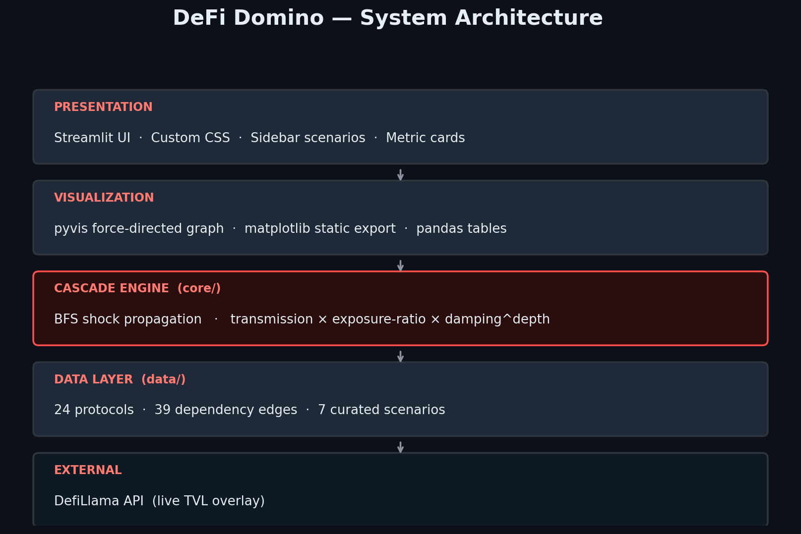
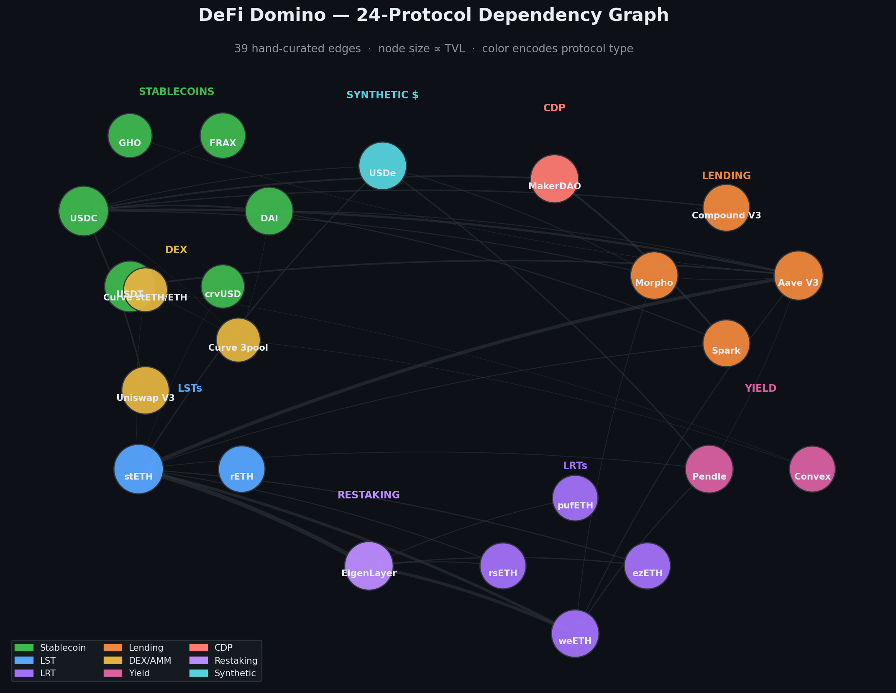

<div align="center">

# 🩸 DeFi Domino

### Protocol Contagion Risk Mapper

**Stress-test the entire DeFi ecosystem against any single-protocol failure.**

[](https://www.python.org/)
[](https://streamlit.io)
[](LICENSE)
[](tests/backtest.py)

[**Live Demo →**](https://defi-domino.streamlit.app) &nbsp;·&nbsp; [Methodology](#-methodology) &nbsp;·&nbsp; [Scenarios](#-scenarios-shipped) &nbsp;·&nbsp; [Architecture](#%EF%B8%8F-architecture)

</div>

---

## 🧩 The problem

> *Terra → Anchor → 3AC → Celsius → Voyager.*

The 2022 collapses were predictable if anyone had mapped the on-chain dependencies between protocols. Every major DeFi failure since has followed the same pattern: a single asset depegs or a single protocol gets exploited, and the cascade through interconnected collateral, lending markets, AMMs, and yield protocols is what does the real damage.

Internal risk firms like **Gauntlet, Chaos Labs, and Block Analitica** run private contagion models for individual protocols — locked behind $50K+/month enterprise contracts. **No public, retail-facing tool maps cross-protocol contagion in DeFi as a whole.**

DeFi Domino is that tool.

## ✨ What it does

Pick a failure scenario — or build a custom one — and the cascade engine simulates how the shock propagates across the dependency graph.

|  |  |
|---|---|
| **Total systemic loss** | Live $ figure across the whole ecosystem |
| **Contagion graph** | Force-directed visualisation, edge thickness ∝ propagated shock |
| **Ranked impact list** | Top-12 protocols hit, with the cascade path that reached them |
| **Mechanism trace** | Hop-by-hop audit trail — every dollar figure is auditable |
| **Live TVL overlay** | DefiLlama API refresh on demand |

## 🗺️ Architecture

<div align="center">
  
</div>

## 🌐 The dependency graph

24 protocols. 39 hand-curated edges. Every exposure sourced from Aave reserve dashboards, MakerDAO PSM stats, Lido integration registries, EigenLayer LRT data, Pendle market lists, and governance forum risk reports from Gauntlet, Chaos Labs and Block Analitica.

<div align="center">
  
</div>

## 📐 Methodology

For each edge from holder → held-asset, the cascade engine computes:

```
downstream_shock  =  upstream_shock × transmission × (exposure_usd / source_tvl) × damping^depth
```

| Factor | What it captures |
|---|---|
| `transmission` (0–1) | Real-world buffers — over-collateralization, insurance funds, partial reserve diversification |
| `exposure / TVL` | The fraction of a protocol's balance sheet exposed to the upstream asset |
| `damping = 0.85` | Per-hop decay; prevents runaway cycles in densely-connected sub-graphs |
| BFS depth = 4 | Enough to trace LRT → LST → lending → yield chains |
| Threshold = 0.05 % | Prunes vanishing impacts to keep the graph readable |

### What it models well
First-order liquidation cascades, collateral re-pricing, PSM/AMM imbalances, multi-hop LRT → LST → lending market chains, EigenLayer → LRT slashing propagation.

### What it does not model (honest limitations)
Reflexive panic flows, oracle latency, MEV during unwinds, off-chain redemption queue dynamics. These tend to *amplify* modelled losses — figures here should be read as a **structural lower bound**, not an upper bound.

## ⚡ Scenarios shipped

| | Scenario | Historical reference |
|---|---|---|
| 🟢 | **USDC Depeg — SVB Repeat** | March 2023, USDC traded $0.87–$0.95 for 48h |
| 🔵 | **stETH Discount Widens** | June 2022, stETH/ETH bottomed 0.935 during 3AC unwind |
| 🟢 | **Tether Reserve Crisis** | October 2018, USDT traded $0.85 amid Bitfinex banking |
| 🟪 | **EigenLayer Mass Slashing** | April 2024 ezETH depeg event (mechanism-adjacent) |
| 💎 | **Ethena Sustained Negative Funding** | Q2 2024 funding compression |
| 🟠 | **Aave V3 Critical Exploit** | Hypothetical — Cream / Euler reference |
| 🟡 | **Curve 3pool Drain** | July 2023 Vyper compiler exploit ($73M) |

Plus full custom mode — pick any node as epicenter and any shock magnitude.

## 🚀 Quickstart

```bash
git clone https://github.com/Rajatd91/defi-domino.git
cd defi-domino
python3 -m venv .venv && source .venv/bin/activate
pip install -r requirements.txt
streamlit run app.py
```

Then open <http://localhost:8501>. Hit **Refresh TVL from DefiLlama** in the sidebar to overlay live TVL on the static baseline.

## 🗂️ Repo layout

```
defi-domino/
├── app.py                          # Streamlit UI — the entry point
├── core/
│   ├── cascade.py                  # BFS shock-propagation engine
│   ├── visualizer.py               # pyvis force-directed graph rendering
│   └── tvl_fetcher.py              # DefiLlama live TVL overlay
├── data/
│   ├── protocols.py                # 24 protocols, 39 dependency edges
│   └── scenarios.py                # 7 curated failure scenarios
├── tests/
│   └── backtest.py                 # 70+ data-integrity & math checks
├── scripts/
│   └── generate_architecture.py    # Re-builds the assets/ diagrams
├── presentation/
│   ├── DeFi_Domino_Pitch.pptx      # 8-slide pitch deck
│   └── build_pptx.py               # Source for the deck
├── assets/                         # Architecture diagrams
└── .streamlit/config.toml          # Dark theme
```

## ✅ Backtest

```bash
python3 tests/backtest.py
```

70+ checks covering: data integrity (every edge endpoint exists), every preset scenario, every protocol as epicenter, edge cases (tiny shock / huge shock / leaf nodes), and a mass-conservation sanity bound (no protocol's loss can exceed its own TVL).

## 🛣️ Roadmap

- [ ] Smart-contract-level oracle dependency edges (Chainlink, Pyth)
- [ ] Per-chain L2 cascade splits (Arbitrum, Base)
- [ ] Historical backtesting — replay the May 2022 / March 2023 cascades
- [ ] Webhook alerts when DefiLlama-live TVL crosses risk thresholds
- [ ] Solvency stress tests for restaking AVS slashing bounds

## 📜 License

[MIT](LICENSE) © 2026 Rajat Durge
